# Proposed architecture

This document describes the intended architecture of the first ODEU Worldstate MVP.
No runtime implementation is claimed by this design scaffold.

## System invariant

The canonical object is the user-owned worldstate. Conversations, model calls, agent
runs, files, and test results are sources and events around it; none may silently
replace it.

```mermaid
flowchart LR
    H["Human"] --> S["Chat or voice source event"]
    S --> P["GPT-5.6 placement proposal"]
    P --> R["Human review"]
    R -->|accept| W["Canonical worldstate"]
    R -->|revise or reject| P
    W --> C["Scoped projection compiler"]
    C --> B["Agent brief"]
    B --> A["Codex or another agent"]
    A --> X["Work result and evidence"]
    X --> Q["Reconciliation proposal"]
    Q --> R
```



Both entry and return paths cross an explicit review boundary. A model may propose a
worldstate delta, and an agent may provide a closure witness, but neither is thereby
authorized to rewrite canonical state.

## Layers

### 1. Worldstate kernel

The kernel holds the precise semantic representation:

- stable identities for projects, goals, ideas, decisions, constraints, questions,
  tasks, artifacts, evidence, and agent runs;
- typed relations such as `refines`, `depends on`, `conflicts with`, `implements`,
  `supersedes`, `evidenced by`, and `originated from`;
- separate knowledge, governance, and work statuses;
- accepted revisions and conceptual genealogy;
- provenance bindings to source artifacts;
- visibility and delegation boundaries.

The current worldstate is a projection of accepted history. History is retained so a
later interpretation can be audited without treating an obsolete idea as current.

### 2. Worldmodel manager runtime

The manager interprets source events against the current state. Its jobs are to:

- select the relevant project and scope;
- ask GPT-5.6 for a structured placement or reconciliation proposal;
- preserve uncertainty and offer alternative placements when needed;
- validate proposed deltas against kernel constraints;
- prepare reviewable receipts for the human;
- compile least-context briefs for agents;
- reconcile agent evidence into a new proposal.

For the MVP, one runtime may serve two profiles over the same hierarchical state:

- **World profile:** active projects, long-term goals, user preferences, and available
  agent profiles.
- **Project profile:** project structure, decisions, work threads, artifacts, progress,
  and unresolved questions.

This is a scope distinction, not two competing sources of truth.

### 3. Worldstate Studio

The Studio is the human work surface. It exposes friendly concepts and several lawful
projections of the same state:

- **Outline:** hierarchy and verbal structure.
- **Map:** relationships, dependencies, and conflicts.
- **Timeline:** conceptual genesis and revision history.
- **Focus:** one update or decision with progressive detail.

Changing views preserves node identity, meaning, status, provenance, selection, and
authority. Only arrangement, density, navigation, disclosure, and salience may morph.
These are proposed local product profiles based on borrowed Morphic UX doctrine, not
implemented or upstream-approved profiles.

### 4. Projection and agent boundary

An agent does not receive the canonical worldstate. The projection compiler produces
a bounded brief containing only what the run needs:

- goal and completion criteria;
- relevant objects and relationships;
- known evidence and explicit unknowns;
- applicable constraints and allowed actions;
- selected artifacts and environment references;
- expected return evidence.

The first reference adapter is intended for Codex. Other agents may later implement
the same projection and closure contracts without changing the kernel.

### 5. Source and evidence archive

Raw conversations, voice transcriptions, files, commits, test results, and agent logs
remain inspectable artifacts. They do not need to reside permanently in the manager's
active context. Canonical nodes keep provenance references so supporting material can
be retrieved when it becomes relevant.

## ODEU lanes

ODEU supplies a universal grammar while each project supplies concrete content.

| Kernel lane | Human-facing question | Project content |
| --- | --- | --- |
| O | What are the things and connections? | Projects, goals, concepts, artifacts, environments, relations |
| E | What do we know? | Sources, evidence, uncertainty, challenges, freshness |
| D | What are the rules and permissions? | Ownership, constraints, agent scope, review and commit gates |
| U | What matters? | End goals, priorities, risks, tradeoffs, completion criteria |

The manager applies this grammar to a particular world. It does not require the user
to learn the abstract terminology.

## State and authority model

Three independent status families prevent semantic collapse:

```text
Knowledge:   Draft -> Supported -> Challenged / Open / Out of date
Governance:  Suggested -> Adopted / Restricted / Approval needed
Work:        Planned -> Running -> Blocked / Completed -> Verified
```

Examples:

- An adopted goal may still rest on challenged evidence.
- A completed agent run may still produce an unverified result.
- A supported observation does not grant an agent permission to act on it.

The interface must render these differences and keep required evidence reachable
before a person commits a semantic update or delegates work.

## Core transitions

1. **Capture:** retain the incoming message or voice transcription as a source event.
2. **Interpret:** propose a typed placement against a specific worldstate revision.
3. **Review:** show placement, relations, evidence, uncertainty, and alternatives.
4. **Commit:** accept a bounded delta and record its provenance.
5. **Project:** compile a least-context agent brief from the accepted state.
6. **Execute:** let the agent act within its declared scope.
7. **Witness:** return artifacts, checks, observed effects, and unresolved issues.
8. **Reconcile:** propose, review, and optionally commit the resulting state change.

## Initial non-goals

- A universal civic worldstate standard.
- Autonomous mutation of the user's canonical state.
- A general replacement for every notes, project-management, or graph product.
- Full federation across providers and institutions.
- A complete constitutional authorization system.
- Treating a transcript summary as the worldstate.

Those directions may inform the design, but they are not needed to prove the MVP's
central claim: explicit shared state can make ordinary agent-assisted work more
continuous, legible, and governable.
