# MVP architecture

This document describes the architecture of the first ODEU Worldstate MVP. The v0
foundation implements the kernel contracts and each principal adapter boundary. The
current workbench connects browser state, IndexedDB, the placement API, reduced
projections, human semantic commit, durable brief preview, replay/live delegation,
independent evidence validation, deterministic reconciliation, separate semantic
integration, and a distinct reviewed operator artifact-promotion boundary as one
durable slice.

## Implementation boundary

| Surface | v0 status |
| --- | --- |
| Worldstate kernel | Implemented and contract-tested as an append-only deterministic reducer |
| Worldstate Studio | Reduced-ledger Outline, Map, Timeline, and Focus wired through durable placement review, commit, brief preview, replay/live observation, staged closure/candidate review, independent validation, reconciliation, and separate authority gates |
| Placement manager | Deterministic fixture and opt-in live structured-output gateway implemented |
| Projection compiler | Least-context execution projection and privacy checks implemented |
| Codex adapter | Brief-bound fixture replay and guarded opt-in live adapter implemented |
| Persistence | IndexedDB is active in the workbench; batch validation, immutable-prefix checks, and full-ledger CAS gate normal writes, while confirmed sandbox reset uses one atomic project replacement only when no promotion is `authorized` or `outcome_unknown` and no terminal browser claim awaits exact host re-attestation |
| Source → placement → commit wiring | Implemented and exercised with the deterministic placement route |
| Durable delegation wiring | Replay and live paths implemented; live authority is server-minted from current ledger/Git state, the exact signed attempt precedes dispatch, and status recovery does not blindly redispatch |
| Candidate sealing | Every returned live result requires a retained content-addressed Git candidate and signed receipt sealed before the worktree lease is released |
| Evidence validation wiring | Registered replay verification and exact sealed-live-candidate verification implemented; only server-registered bounded checks may produce requirement observations |
| Reconciliation/integration wiring | Implemented for replay and live evidence; a live receipt can establish exact-candidate execution but never causal model authorship, and semantic integration never promotes artifacts |
| Artifact promotion | Implemented as a later exact-origin, transient-Bearer operator authorization and exact Git target-ref compare-and-swap, with a signed private journal and explicit promoted/stale/failed/outcome-unknown outcomes |
| External provider proof | A diagnostic-only local ChatGPT-session Codex CLI turn is observed; the provider-key-backed application route is not, because `OPENAI_API_KEY` and `CODEX_API_KEY` are absent |

## System invariant

The canonical object is the user-owned worldstate. Conversations, model calls, agent
runs, files, and test results are sources and events around it; none may silently
replace it.

```mermaid
flowchart LR
    H["Human"] --> S["Chat or voice source event"]
    S --> P["Manager placement proposal"]
    P --> R["Human review"]
    R -->|accept| W["Canonical worldstate"]
    R -->|revise or reject| P
    W --> C["Scoped projection compiler"]
    C --> B["Agent brief"]
    B --> A["Codex or another agent"]
    A --> X["Work result and evidence"]
    X --> G["Sealed Git candidate (live only)"]
    X --> V["Independent validation"]
    G --> V
    V --> Q["Semantic reconciliation proposal"]
    Q --> I["Human semantic review"]
    I -->|accept| W
    I -->|revise or reject| Q
    G --> AP["Artifact promotion proposal"]
    W --> AP
    AP --> PH["Human artifact review"]
    PH -->|record audit and coordination| OA["Exact-origin operator Bearer POST"]
    OA -->|authorize one exact CAS| T["Authoritative Git target ref"]
```



Both entry and return paths cross an explicit review boundary. A model may propose a
worldstate delta, and an agent may provide a closure witness, but neither is thereby
authorized to rewrite canonical state.

The implemented runtime follows one common capture/commit path, then an explicitly
selected replay or live execution path:

```text
typed source
  → source.captured + exact shared-only request persisted atomically
  → placement request dispatched
  → exact manager exchange persisted as system evidence
  → pending delta persisted without advancing the head
  → human delta.accepted
  → one new canonical revision
  → immutable least-context brief persisted without run authority
  → runtime capability reports replay, live, or unavailable without silent fallback
  → separate human authorization for one exact run
  → for live: server re-reduces current ledger/Git state and signs one short-lived capability
  → exact signed execution request persisted before dispatch
  → exact typed response persisted before normalization
  → state-dependent lifecycle normalization and optional closure staging
  → durable normalization-failure evidence and lawful outcome_unknown on incoherence/conflict
  → staged result review with claims and SDK observations still provisional
  → for a returned live result: worktree changes sealed as a signed retained Git candidate
  → exact independent-validation request persisted before verification
  → replay: digest-pinned fixture bundle checked with fixed vectors
  → live: signed Git objects/manifest/patch recomputed and two registered blobs materialized read-only
  → live: digest-pinned host harness executes fixed vectors in a bounded no-network sandbox
  → exact verifier response persisted before evidence.validation_recorded
  → grounded validation pinned by exact identity
  → integrity-bound reconciliation receipt + delta.proposed persisted atomically
  → reviewable candidate with no canonical mutation
  → separate human-only delta.accepted
  → one semantic revision; artifactPromotion remains not_performed
  → live only: exact artifact-promotion proposal persisted after semantic integration
  → browser human authorization persisted for audit and cooperative head reservation
  → operator Bearer POST reconstructs and SHA-256 binds that exact ledger prefix
  → signed create-only private authority intent persisted before Git
  → its digest chained into one create-only attempt and the signed status
  → only the attempt creator may compare-and-swap the raw direct commit ref; adopters,
    including raced create adopters, never repeat it
  → exact promotion status persisted as promoted, stale, failed, or outcome_unknown
```

The request attempt and exact manager exchange are integrity-checked system evidence,
not truth. Persisting the attempt before dispatch makes an interrupted request
recoverable with its original source and selected target. Success receipts carry the
request ID and are rejected if source, revision, scope, project, bounded targets, or
request correlation disagree. A converted pending delta remains provisional in every
projection until the reducer observes the human acceptance event.

The delegation return crosses two durable boundaries. First, the exact schema-valid
response exchange is persisted independently of any state-dependent interpretation.
Only afterward does the session check immutable bindings and the current run state,
then normalize lifecycle events and optionally stage a closure. A compare-and-swap
race reloads durable truth without calling the selected gateway again. If normalization
still cannot apply because of response incoherence or state conflict, an integrity-bound
normalization-failure record is durable and the run becomes terminal
`outcome_unknown` when that transition remains lawful; no closure is invented. Reload
after an attempt with no response likewise reports an unobserved outcome. Fetch,
body-read, JSON, and response-schema failures instead create a bounded, integrity-bound
transport observation before that terminal transition. Invalid bodies retain HTTP
metadata, a capped excerpt, truncation posture, and a full-body digest; the general
timeline exposes the posture and digest, not the excerpt.

Live dispatch recovery first consults private server status. A durable `completed`
response is consumed without redispatch. `not_started` exposes an explicit retry of
the exact previously signed request with the same run/request IDs and no new authority
event; `in_progress` refuses a duplicate. A private `outcome_unknown` observed during
dispatch contention remains a nonterminal queued browser posture because another
server process may still be executing. It is distinct from the durable domain
`outcome_unknown` terminal produced from response or normalization evidence.

Initialization scans queued runs for an integrity-checked exact exchange. If a host
stopped after the response write, it resumes only deterministic normalization from that
durable evidence; if a normalization-failure source was already written, it completes
the lawful `outcome_unknown` transition. Neither recovery path calls the gateway.
Response persistence also retries bounded CAS churn against each newly loaded ledger,
so ordinary concurrent projection writes do not discard an observed response.

Independent replay validation crosses the same two durable boundaries. The browser
first saves a request bound to the closure, run, brief, worldstate base, artifact base,
replay identity, semantic brief digest, exact Codex exchange, and complete evidence
contract. A fixed server registry—not the worker report—selects a separately authored
fixture bundle. It bounds and SHA-256-checks both the real HTML and its imported
calculation module, then imports those exact support-module bytes and runs fixed
in-process vectors labelled `fixture_equivalent`; the displayed npm command is not
executed and no client command can select verifier behavior. The exact verifier
response is saved before domain normalization. Passing observations reference that
integrity-bound shared system source, and the kernel recomputes its semantic
fingerprint from the actual source content rather than trusting integrity metadata
alone. If the response is durable but the host
stops, initialization records validation without calling the verifier again. This
transition is read-only with respect to canonical state.

Live validation uses a separate fixed server boundary. A returned live closure must
carry the exact signed candidate receipt created while the execution host still holds
its worktree lease; a returned live response without that candidate is invalid. The
receipt identifies a retained `refs/odeu/candidates/...` commit and binds its single
parent base, tree, normalized changed-path/blob/mode manifest, binary-patch digest,
repository identity, intended branch ref, run, brief, and worldstate base. The live
validator rejects replay, unregistered repositories, bad signatures, substituted Git
objects, unsafe paths/modes, and commands supplied by the browser. It reconstructs an
isolated read-only input containing only the registered HTML and support-module Git
blobs, then runs an immutable digest-pinned host harness under bubblewrap and prlimit.
The authored `npm test -- moving-cost` command is not executed. Passing requires an
exact nonce- and digest-bound report for all registered vectors, not merely exit code
zero. The durable execution observation records the harness pin, support blob, cases,
and per-process limits; it explicitly does not claim aggregate cgroup isolation. Its
exact response is persisted before `evidence.validation_recorded`, just like replay
validation.

Here, “independent” means a separate server-owned validation transition and host-owned
harness, not a separate cryptographic principal: the v0 verifier registry possesses
the symmetric candidate-signing material. Promotion therefore additionally requires
exact private completed-response provenance rather than trusting a valid receipt alone.

Result reconciliation is another explicit durable boundary. A deterministic compiler
reconstructs the candidate from the current returned closure and the exact validation
named by `validationRef`; it does not consult a mutable “latest validation” pointer at
commit time. The compiler also binds the active Task, run, brief, worldstate base,
artifact base, exact Codex exchange, and exact verifier exchange. The integrity-bound
receipt and its byte-equivalent `delta.proposed` are appended in one transaction, so a
partial proposal cannot appear and the canonical head does not advance. The proposal
patches the Task, adds a linked Evidence node, and retains an explicit verification
scope. Replay retains `registered_fixture_bundle` and no causal-execution claim. A
passed live exchange records `sealed_live_candidate` and
`causalExecutionEstablished: true`, because the exact registered check executed against
the exact sealed candidate. Both modes retain `causalAuthorshipEstablished: false`—the
evidence does not cryptographically identify the model as the author—and
`artifactPromotion: not_performed`.

Integration is a later command, not proposal normalization. The kernel rechecks the
pinned validation, current worldstate revision, closure lineage, required evidence,
disposition, and artifact base, and it refuses reconciliation acceptance from manager,
agent, or system actors. Only a human-authored `delta.accepted` may create the next
canonical revision. Operational-only compare-and-swap races may retry the exact
proposal or acceptance, while a canonical head advance leaves the proposal visibly
stale rather than silently rebasing it.

Artifact promotion is a later operational authority boundary, not part of
`delta.accepted`. It is available only for the current human-integrated live
reconciliation whose signed candidate and passed independent validation reproduce
exactly. A deterministic proposal binds that semantic revision, candidate receipt,
repository, target branch, expected base, candidate commit/tree, manifest, and patch.
The browser persists the exact request and a human-actor authorization event for audit,
review coordination, and cooperative semantic-head reservation. That actor event is
not the server security authority. The external action is authorized only by
possession of the transient operator Bearer on an exact-origin POST.

Under the repository lock and before any Git attempt, the host persists a signed,
create-only private authority intent. It binds the promotion and candidate identities,
project, semantic head, authorization event, ledger version, and a host-computed
SHA-256 digest of the exact ledger prefix ending at authorization. The canonical
`authorityIntentDigest` is then carried and signed by both the create-only attempt and
terminal status, so status recovery must reproduce the same authority chain. The
browser's reservation prevents cooperating sessions from advancing the semantic head
while the promotion is `authorized`; it is coordination, not a security boundary. A
terminal `outcome_unknown` releases that semantic reservation, but sandbox reset stays
blocked for both states to preserve recovery and audit evidence. Terminal browser
claims also keep reset blocked until their exact receipt is re-attested by the
read-only host journal. An external/shared document replacement clears ephemeral
attestation so the current authority context must reacquire it. The private signed
journal plus Git's expected-old-value CAS are the server boundary, and reset never
reverses Git.

Before Git, the candidate must also equal the candidate in the exact private completed,
successful, returned live response, with its live intent, dispatch/request digest, and
published-ledger digest intact. The server derives the evidence contract from that
private brief, requires the durable validation request to match, and freshly reruns
the immutable host verifier. It rechecks candidate Git objects, requires the raw OID
of each retained/target ref to name a commit directly, refuses symbolic refs,
annotated-tag peeling, and checked-out targets, and may execute one compare-and-swap equivalent to
`update-ref --no-deref <target> <candidate> <expected-base>`; it never rebases,
cherry-picks, or updates a worktree. A process adopting an existing durable attempt
never executes the CAS again. This includes a process whose create raced and adopted
the winner's attempt rather than creating its own. Consequently, a crash after attempt
creation but before the CAS can end as terminal `outcome_unknown` and require operator
reconciliation, without blocking later semantic deltas. Stale guards or locks receive
the same explicit reconciliation treatment rather than being deleted and retried.

Only an observed raw direct target-ref OID equal to the exact candidate commit is
recorded as `promoted`; a symbolic ref or annotated tag that peels to the same commit
does not satisfy that observation. A
mismatched base is `stale`; definite failures and an unobservable result remain
`failed` and `outcome_unknown`. A completed signed receipt is immutable historical
evidence of what the host observed at that time, not proof of the ref's current value.
Reload must re-attest the exact receipt through the read-only host status boundary
before rendering a terminal claim as authoritative.

Adapter lifecycle timestamps stay inside the exact response as provider claims. The
mapper rejects a backward adapter timeline, but normalized lifecycle and closure events
use host observation time; append order, not a provider clock, orders domain evidence.

## Layers

### 1. Worldstate kernel

The kernel holds the precise semantic representation:

- stable identities for projects, goals, ideas, decisions, constraints, questions,
  tasks, artifacts, evidence, and agent runs;
- typed relations such as `refines`, `depends on`, `conflicts with`, `implements`,
  `supersedes`, `evidenced by`, and `originated from`;
- separate knowledge, governance, and work statuses;
- accepted revisions and conceptual genealogy;
- provenance bindings to source artifacts;
- visibility and delegation boundaries.

The current worldstate is a projection of accepted history. History is retained so a
later interpretation can be audited without treating an obsolete idea as current.

### 2. Worldmodel manager runtime

The manager interprets source events against the current state. Its jobs are to:

- select the relevant project and scope;
- obtain a structured placement or reconciliation proposal from a deterministic
  fixture or an explicitly configured model;
- preserve uncertainty and offer alternative placements when needed;
- validate proposed deltas against kernel constraints;
- prepare reviewable receipts for the human;
- compile least-context briefs for agents;
- reconcile agent evidence into a new proposal.

The replay/live reconciliation path is a deterministic compiler, not a new model call.
Its receipt is operational evidence until the user separately accepts the exact delta;
even then, the accepted revision is semantic state rather than artifact authority.

For the MVP, one runtime may serve two profiles over the same hierarchical state:

- **World profile:** active projects, long-term goals, user preferences, and available
  agent profiles.
- **Project profile:** project structure, decisions, work threads, artifacts, progress,
  and unresolved questions.

This is a scope distinction, not two competing sources of truth.

### 3. Worldstate Studio

The Studio is the human work surface. It exposes friendly concepts and several lawful
projections of the same state:

- **Outline:** hierarchy and verbal structure.
- **Map:** relationships, dependencies, and conflicts.
- **Timeline:** conceptual genesis and revision history.
- **Focus:** one update or decision with progressive detail.

Changing views preserves node identity, meaning, status, provenance, selection, and
authority. Only arrangement, density, navigation, disclosure, and salience may morph.
These are implemented local product projections based on borrowed Morphic UX doctrine;
they are not upstream-approved profiles.

The browser UI holds only presentation state such as the selected view, disclosure,
draft text, and reset confirmation. Canonical nodes, relations, receipts, event history,
and revision labels are rebuilt from the persisted ledger. Map coordinates are a
deterministic projection artifact and never enter canonical state.

The opening onboarding chapter is a separate presentation control plane over that
same Studio. Consent offers `Interactive`, `Watch only`, and `Skip`; guidance can be
paused, resumed, replayed, and shown with or without captions, while unavailable audio
is stated explicitly. Progress is derived from the workbench's observed project, view,
and selected-object state rather than elapsed time or simulated clicks. In watch-only
mode the guide may issue idempotent typed commands to select a project, projection, or
object. Those commands have no ledger, gateway, session, provider, or agent authority.
The opening stops at the source-capture handoff and, after ordinary sandbox bootstrap,
adds no canonical event and advances no revision.

### 4. Projection and agent boundary

An agent does not receive the canonical worldstate. The projection compiler produces
a bounded brief containing only what the run needs:

- goal and completion criteria;
- relevant objects and relationships;
- known evidence and explicit unknowns;
- applicable constraints and allowed actions;
- selected artifacts and environment references;
- expected return evidence.

The first reference adapter is implemented for Codex in replay and live modes. The
browser session compiles the latest accepted Task into a durable brief, shows the exact
shared slice and local omission receipt, reports the effective runtime mode, and
requires a separate action to authorize one exact run. Replay is the default and is
never presented as live. For live mode, a server route validates the supplied current
ledger document and server-private Git/runtime configuration before minting the
short-lived signed request. The attempt record contains that exact immutable request
and is durable before dispatch. A returned exchange preserves the exact typed response
before normalization. The separate normalization step deliberately omits the adapter's
initial `queued` event, uses host observation time, and may stage a coherent closure
without changing canonical state. Incoherence or state conflict remains durable
failure evidence with `outcome_unknown`, not a synthetic worker result.
Returned claims, claimed checks, and SDK file/command observations remain distinct and
are not independent validation. The registered replay can instead be checked against a
separate bundle containing digest-pinned HTML and its imported support module. That
fixture verifier executes fixed cases against the exact module bytes and proves only
its observed bundle; it does not claim a live Codex run or causal authorship of
repository changes. The resulting semantic reconciliation likewise records
`artifactPromotion: not_performed`; no fixture file is deployed or promoted by the
worldstate commit.

The guarded live mode requires a signed authorization derived from an authorized
kernel run, exact worldstate and Git bases, a constrained worktree,
an isolated runtime environment, and disabled worker network access. Capabilities are
short-lived and atomically consumed once per run on the execution host. The host
re-reduces a validated current ledger export and creates the persistent dispatch claim
under one per-run guard. Every authoritative pre-dispatch cancellation or lifecycle
writer must use the same guard, so cancellation becomes unavailable once dispatch
linearizes. The configured ledger file and its parent path cannot be symlinks, keeping
atomic replacement at the configured path observable. The host also requires the run
still be queued and live and holds an exclusive worktree lease through execution. The
worktree must be clean and contain no ignored files; its toolchain belongs outside the
worker-visible tree. Git preflight disables hooks, protocols, and lazy fetching and
refuses repository/worktree includes, executable filters, promisor/partial-clone
helpers, and index gitlinks before status or ref inspection. Agent reports are claims;
SDK file and command events are retained separately as observations. Before a returned
live result can leave the execution lease, the host writes the worktree changes to a
deterministic single-parent candidate commit, retains a content-addressed candidate
ref, and signs its receipt with a key
distinct from run authorization. The worker never receives the signing secret and
never moves the authoritative target ref. A blocked report remains a non-closure
evidence object; the v0 adapter does not yet resume its Codex thread. Other agents may
later implement the same projection and closure contracts without changing the kernel.

The browser/server handoff carries only the bounded ledger document and typed IDs.
Workspace, repository, toolchain, candidate-store, signing, and promotion-status
configuration remain server-private. Live execution requires a provider key plus the
Codex workspace/home, ledger/authority store, authorization secret, repository/target
identity, candidate store, and artifact signing key. Independent live validation uses
a server registry of repositories and signing keys. Promotion additionally requires a
dedicated bare authoritative repository, reached at its exact symlink-free root, and a
native private POSIX journal for authority, attempt, and status records. Every journal
component is owner/mode checked and symlink-free; descriptor-anchored journal I/O
currently assumes Linux `/proc`. A complete record is written and fsynced to a private
same-directory temporary file, atomically installed create-only, and followed by a
directory fsync before readers may adopt it. Its application lock serializes cooperating ODEU writers; Git's
expected-old-value CAS protects against external writers. Old verification keys must
remain configured while receipts signed by them can still be recovered. A crash-stale
guard or lock is fail-closed and requires operator reconciliation. Operator-triggered
live routes require an exact `ODEU_OPERATOR_ALLOWED_ORIGIN` over HTTPS except for an
exact loopback development origin,
`Sec-Fetch-Site: same-origin`, and an at-least-32-byte
`ODEU_OPERATOR_BEARER_SECRET`, checked before privileged reads or actions. Bearer
possession is operator authority, not human identity proof. The browser gateway
supplies that secret only as an
`Authorization` header from memory; it never enters local storage, the ledger, a
request body, or a query string. These settings are declared in `.env.example`; other
secrets are neither persisted in the browser ledger nor inherited by the worker shell.

Contract, route, session, and deterministic temporary-Git evidence exercise the live
authority, sealing, validation, and promotion adapters. A separate opt-in local-session
diagnostic observed one real external turn through the project-bundled Codex CLI and
an existing ChatGPT login, then independently verified its sole disposable artifact.
The POSIX-only harness repeatedly kills and waits for the inherited process group to
disappear before reading artifacts through no-follow descriptors, requires an ordered
usage-bearing turn with a successful local tool event, and records installed CLI/native
and harness-source digests without claiming causal tool authorship or package-integrity
reverification of those installed bytes. This is not cgroup-level process-tree
containment: a descendant that deliberately starts a new session is not proven absent,
and the diagnostic therefore claims neither escaped-descendant containment nor a
race-free workspace snapshot.
That evidence is intentionally non-authoritative: it does not pass through the signed
application live route and cannot establish a closure, retained candidate,
reconciliation, or promotion. Both `OPENAI_API_KEY` and `CODEX_API_KEY` were absent at
this checkpoint, so the provider-key-backed application route remains explicitly
unobserved.

### 5. Source and evidence archive

The target archive retains raw conversations, voice transcriptions, files, commits,
test results, and agent logs as inspectable artifacts. They do not need to reside
permanently in the manager's active context. The kernel already binds canonical nodes
to provenance references. The current slice stores typed text sources and exact
placement, Codex, replay/live-validation, reconciliation, and promotion
attempt/exchange records inside the local append-only ledger. Signed candidate and
promotion receipts address retained Git objects and server-side status without copying
secrets or host paths into the worldstate. Broader file, voice, and external
source-archive ingestion remain future integration work.

## ODEU lanes

ODEU supplies a universal grammar while each project supplies concrete content.

| Kernel lane | Human-facing question | Project content |
| --- | --- | --- |
| O | What are the things and connections? | Projects, goals, concepts, artifacts, environments, relations |
| E | What do we know? | Sources, evidence, uncertainty, challenges, freshness |
| D | What are the rules and permissions? | Ownership, constraints, agent scope, review and commit gates |
| U | What matters? | End goals, priorities, risks, tradeoffs, completion criteria |

The manager applies this grammar to a particular world. It does not require the user
to learn the abstract terminology.

## State and authority model

Three independent status families prevent semantic collapse:

```text
Knowledge:   Draft -> Supported -> Challenged / Open / Out of date
Governance:  Suggested -> Adopted / Restricted / Approval needed
Work:        Planned -> Running -> Blocked / Completed -> Verified
```

Examples:

- An adopted goal may still rest on challenged evidence.
- A completed agent run may still produce an unverified result.
- A supported observation does not grant an agent permission to act on it.

The interface must render these differences and keep required evidence reachable
before a person commits a semantic update or delegates work.

## Core transitions

1. **Capture — wired:** retain typed input as a durable source before any manager call.
2. **Interpret — wired:** propose a typed placement against the exact current revision.
3. **Review — wired:** show persisted placement, relations, evidence, uncertainty, and alternatives.
4. **Commit — wired:** accept one bounded delta and record its provenance in one new revision.
5. **Project — wired:** persist and inspect a least-context agent brief from the latest accepted Task without granting run authority.
6. **Execute — replay/live wired:** separately authorize one immutable request; live authority is minted from current server-validated ledger and Git state, while replay remains the truthful fallback.
7. **Witness — exact response first:** separately normalize lifecycle and optionally stage a closure; a returned live closure requires its signed retained Git candidate, while failed normalization preserves lawful `outcome_unknown`.
8. **Validate — mode-specific independent evidence:** verify the registered replay bundle or recompute and execute the exact sealed live candidate, then record grounded requirement observations without changing canonical state.
9. **Reconcile — wired for replay/live:** atomically persist an integrity-bound, validation-pinned semantic proposal. Live evidence may establish exact-candidate execution, never causal model authorship.
10. **Integrate — explicit human semantic commit:** append one human-only `delta.accepted` revision. This still leaves `artifactPromotion: not_performed`.
11. **Promote — separate operator artifact authority:** after integrated live reconciliation, retain the browser human event as audit/coordination, bind its exact SHA-256 ledger prefix in a signed private intent, and permit one Bearer-authorized Git CAS. Terminal receipts are historical host observations and reload must re-attest them.

## Initial non-goals

- A universal civic worldstate standard.
- Autonomous mutation of the user's canonical state.
- A general replacement for every notes, project-management, or graph product.
- Full federation across providers and institutions.
- A complete constitutional authorization system.
- Treating a transcript summary as the worldstate.

Those directions may inform the design, but they are not needed to prove the MVP's
central claim: explicit shared state can make ordinary agent-assisted work more
continuous, legible, and governable.
